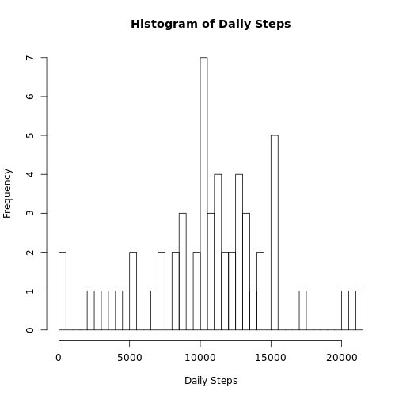
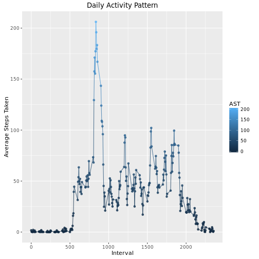
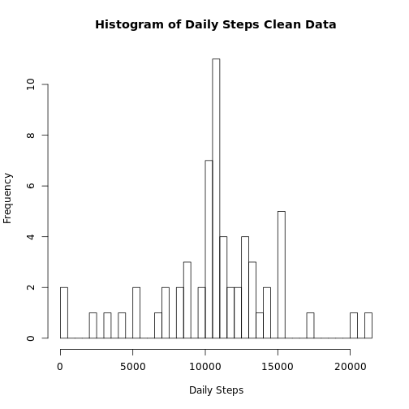
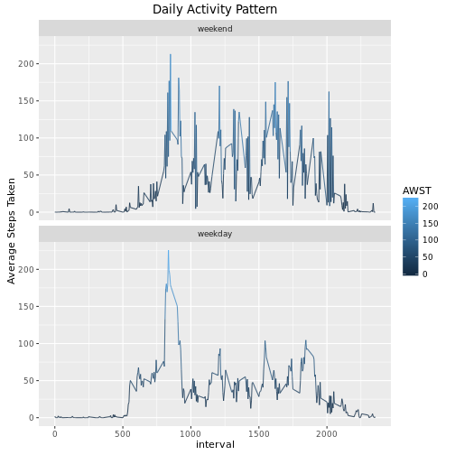

```r
if (!is.element('data.table', installed.packages()[,1]))
  install.packages('data.table', dep = TRUE)
require(data.table) 
```

```
## Loading required package: data.table
```

```
## data.table 1.9.6  For help type ?data.table or https://github.com/Rdatatable/data.table/wiki
```

```
## The fastest way to learn (by data.table authors): https://www.datacamp.com/courses/data-analysis-the-data-table-way
```

```r
require(ggplot2) 
```

```
## Loading required package: ggplot2
```

```r
# Create/set initial Working Directory
dir.create('~/R/', showWarnings = FALSE)
setwd('~/R/')
```

```r
# Get the data if not gotten
dataURL='https://d396qusza40orc.cloudfront.net/repdata%2Fdata%2Factivity.zip'
dataFile='repdata%2Fdata%2Factivity.zip'
if (!file.exists(dataFile)){  download.file(dataURL, destfile = dataFile)  }

# Unzip and get the zip file names
fileList <- unzip(dataFile, list=TRUE)
mainDataF <- fileList[,"Name"][1]
if (!file.exists(mainDataF)){ unzip(dataFile, overwrite = FALSE, setTimes = TRUE) }
```


```r
# Convert Files to data.tables
mainDT <- fread(mainDataF)
```


```r
# mean() total number of steps
Daily_steps <- mainDT[steps != 'NA', .(Daily_steps=sum(steps)), by=.(date)]
hist(Daily_steps$Daily_steps, breaks=dim(Daily_steps)[1],xlab='Daily Steps', main='Histogram of Daily Steps')
```



### Mean and Median Steps by Date

```r
mainDT[steps != 'NA' , .(interval), keyby=.(date,steps) ][, .( Mean=mean(steps), Median=median(steps) ), by=.(Date=date) ]
```

```
##           Date       Mean Median
##  1: 2012-10-02  0.4375000      0
##  2: 2012-10-03 39.4166667      0
##  3: 2012-10-04 42.0694444      0
##  4: 2012-10-05 46.1597222      0
##  5: 2012-10-06 53.5416667      0
##  6: 2012-10-07 38.2465278      0
##  7: 2012-10-09 44.4826389      0
##  8: 2012-10-10 34.3750000      0
##  9: 2012-10-11 35.7777778      0
## 10: 2012-10-12 60.3541667      0
## 11: 2012-10-13 43.1458333      0
## 12: 2012-10-14 52.4236111      0
## 13: 2012-10-15 35.2048611      0
## 14: 2012-10-16 52.3750000      0
## 15: 2012-10-17 46.7083333      0
## 16: 2012-10-18 34.9166667      0
## 17: 2012-10-19 41.0729167      0
## 18: 2012-10-20 36.0937500      0
## 19: 2012-10-21 30.6284722      0
## 20: 2012-10-22 46.7361111      0
## 21: 2012-10-23 30.9652778      0
## 22: 2012-10-24 29.0104167      0
## 23: 2012-10-25  8.6527778      0
## 24: 2012-10-26 23.5347222      0
## 25: 2012-10-27 35.1354167      0
## 26: 2012-10-28 39.7847222      0
## 27: 2012-10-29 17.4236111      0
## 28: 2012-10-30 34.0937500      0
## 29: 2012-10-31 53.5208333      0
## 30: 2012-11-02 36.8055556      0
## 31: 2012-11-03 36.7048611      0
## 32: 2012-11-05 36.2465278      0
## 33: 2012-11-06 28.9375000      0
## 34: 2012-11-07 44.7326389      0
## 35: 2012-11-08 11.1770833      0
## 36: 2012-11-11 43.7777778      0
## 37: 2012-11-12 37.3784722      0
## 38: 2012-11-13 25.4722222      0
## 39: 2012-11-15  0.1423611      0
## 40: 2012-11-16 18.8923611      0
## 41: 2012-11-17 49.7881944      0
## 42: 2012-11-18 52.4652778      0
## 43: 2012-11-19 30.6979167      0
## 44: 2012-11-20 15.5277778      0
## 45: 2012-11-21 44.3993056      0
## 46: 2012-11-22 70.9270833      0
## 47: 2012-11-23 73.5902778      0
## 48: 2012-11-24 50.2708333      0
## 49: 2012-11-25 41.0902778      0
## 50: 2012-11-26 38.7569444      0
## 51: 2012-11-27 47.3819444      0
## 52: 2012-11-28 35.3576389      0
## 53: 2012-11-29 24.4687500      0
##           Date       Mean Median
```


```r
stepsByinteral <- mainDT[steps != 'NA' , .(AST=mean(steps)), by=.(Interval=interval) ]
qplot(data=stepsByinteral, x=Interval, y=AST, 
      main = 'Daily Activity Pattern', 
      ylab = 'Average Steps Taken', 
      geom=c('line','point'), alpha=I(.8), color=AST)
```



### Highest Average Steps by Interval

```r
stepsByinteral[AST==stepsByinteral[,.(max(AST))] ]
```

```
##    Interval      AST
## 1:      835 206.1698
```

### Missing Values

```r
mainDT[is.na(steps), .('NA Count'=sum(is.na(steps))) ]
```

```
##    NA Count
## 1:     2304
```


```r
## Merge the DT with average steps take to the original 'mainDT' to 'mainCleanDT'
mainCleanDT <- merge(x = mainDT, y = stepsByinteral, by.x = 'interval', by.y = 'Interval', all.x = TRUE)
## set NA in steps to average for that Interval
mainCleanDT[is.na(steps), steps := round(AST, digits = 0)]
```

```
## Warning in `[.data.table`(mainCleanDT, is.na(steps), `:=`(steps,
## round(AST, : Coerced 'double' RHS to 'integer' to match the column's
## type; may have truncated precision. Either change the target column to
## 'double' first (by creating a new 'double' vector length 17568 (nrows of
## entire table) and assign that; i.e. 'replace' column), or coerce RHS to
## 'integer' (e.g. 1L, NA_[real|integer]_, as.*, etc) to make your intent
## clear and for speed. Or, set the column type correctly up front when you
## create the table and stick to it, please.
```


```r
DlyStepsClean <- mainCleanDT[, .(DSClean=sum(steps)), by=.(date)]
hist(DlyStepsClean$DSClean, breaks=dim(DlyStepsClean)[1],xlab='Daily Steps', main='Histogram of Daily Steps Clean Data')
```



### Mean and Median Steps by Date Cleaned Data

```r
mainCleanDT[, .(interval), keyby=.(date,steps) ][, .( Mean=mean(steps), Median=median(steps) ), by=.(Date=date) ]
```

```
##           Date       Mean Median
##  1: 2012-10-01 37.3680556   34.5
##  2: 2012-10-02  0.4375000    0.0
##  3: 2012-10-03 39.4166667    0.0
##  4: 2012-10-04 42.0694444    0.0
##  5: 2012-10-05 46.1597222    0.0
##  6: 2012-10-06 53.5416667    0.0
##  7: 2012-10-07 38.2465278    0.0
##  8: 2012-10-08 37.3680556   34.5
##  9: 2012-10-09 44.4826389    0.0
## 10: 2012-10-10 34.3750000    0.0
## 11: 2012-10-11 35.7777778    0.0
## 12: 2012-10-12 60.3541667    0.0
## 13: 2012-10-13 43.1458333    0.0
## 14: 2012-10-14 52.4236111    0.0
## 15: 2012-10-15 35.2048611    0.0
## 16: 2012-10-16 52.3750000    0.0
## 17: 2012-10-17 46.7083333    0.0
## 18: 2012-10-18 34.9166667    0.0
## 19: 2012-10-19 41.0729167    0.0
## 20: 2012-10-20 36.0937500    0.0
## 21: 2012-10-21 30.6284722    0.0
## 22: 2012-10-22 46.7361111    0.0
## 23: 2012-10-23 30.9652778    0.0
## 24: 2012-10-24 29.0104167    0.0
## 25: 2012-10-25  8.6527778    0.0
## 26: 2012-10-26 23.5347222    0.0
## 27: 2012-10-27 35.1354167    0.0
## 28: 2012-10-28 39.7847222    0.0
## 29: 2012-10-29 17.4236111    0.0
## 30: 2012-10-30 34.0937500    0.0
## 31: 2012-10-31 53.5208333    0.0
## 32: 2012-11-01 37.3680556   34.5
## 33: 2012-11-02 36.8055556    0.0
## 34: 2012-11-03 36.7048611    0.0
## 35: 2012-11-04 37.3680556   34.5
## 36: 2012-11-05 36.2465278    0.0
## 37: 2012-11-06 28.9375000    0.0
## 38: 2012-11-07 44.7326389    0.0
## 39: 2012-11-08 11.1770833    0.0
## 40: 2012-11-09 37.3680556   34.5
## 41: 2012-11-10 37.3680556   34.5
## 42: 2012-11-11 43.7777778    0.0
## 43: 2012-11-12 37.3784722    0.0
## 44: 2012-11-13 25.4722222    0.0
## 45: 2012-11-14 37.3680556   34.5
## 46: 2012-11-15  0.1423611    0.0
## 47: 2012-11-16 18.8923611    0.0
## 48: 2012-11-17 49.7881944    0.0
## 49: 2012-11-18 52.4652778    0.0
## 50: 2012-11-19 30.6979167    0.0
## 51: 2012-11-20 15.5277778    0.0
## 52: 2012-11-21 44.3993056    0.0
## 53: 2012-11-22 70.9270833    0.0
## 54: 2012-11-23 73.5902778    0.0
## 55: 2012-11-24 50.2708333    0.0
## 56: 2012-11-25 41.0902778    0.0
## 57: 2012-11-26 38.7569444    0.0
## 58: 2012-11-27 47.3819444    0.0
## 59: 2012-11-28 35.3576389    0.0
## 60: 2012-11-29 24.4687500    0.0
## 61: 2012-11-30 37.3680556   34.5
##           Date       Mean Median
```

#### Weekdays

```r
## Create a weekday factor of 1|0
#mainCleanDT[,weekday := NULL]
mainCleanDT[weekdays(as.POSIXct(mainCleanDT$date)) == c('Saturday','Sunday'), weekday := as.factor('weekend')]
mainCleanDT[weekdays(as.POSIXct(mainCleanDT$date)) != c('Saturday','Sunday'), weekday := as.factor('weekday')]
```


```r
## 
mainCleanDT[weekday == 'weekday', AWST := .('AST'=mean(steps)), by=.(interval) ]
mainCleanDT[weekday == 'weekend', AWST := .('AST'=mean(steps)), by=.(interval) ]

q <- qplot(data=mainCleanDT, x=interval, y=AWST, 
      main = 'Daily Activity Pattern', 
      ylab = 'Average Steps Taken',  geom='line', alpha=I(.8), color=AWST)
q + facet_wrap(~weekday, ncol=1)
```


